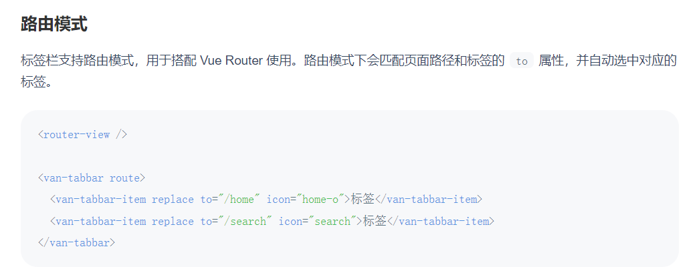
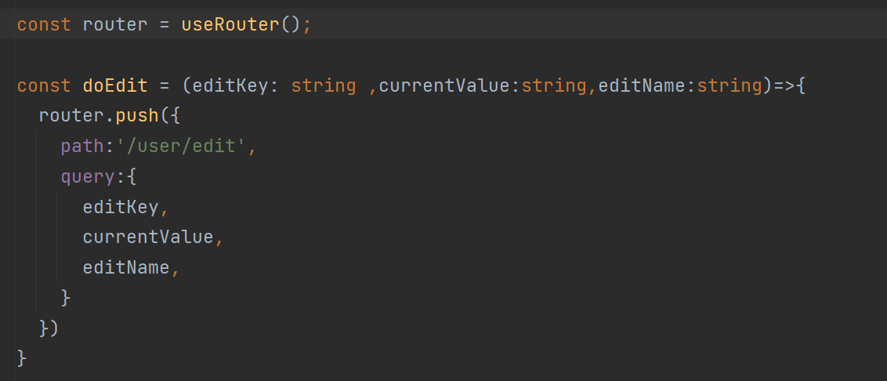
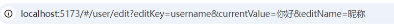
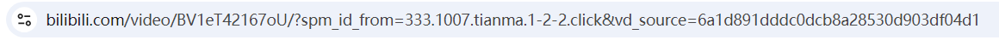
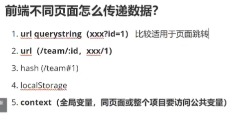
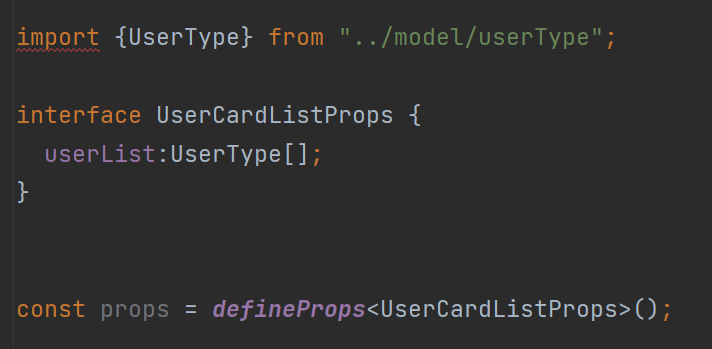
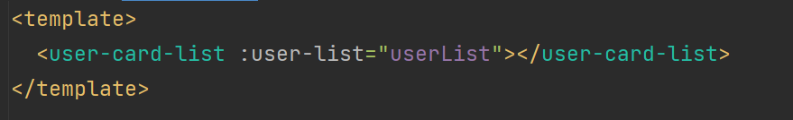
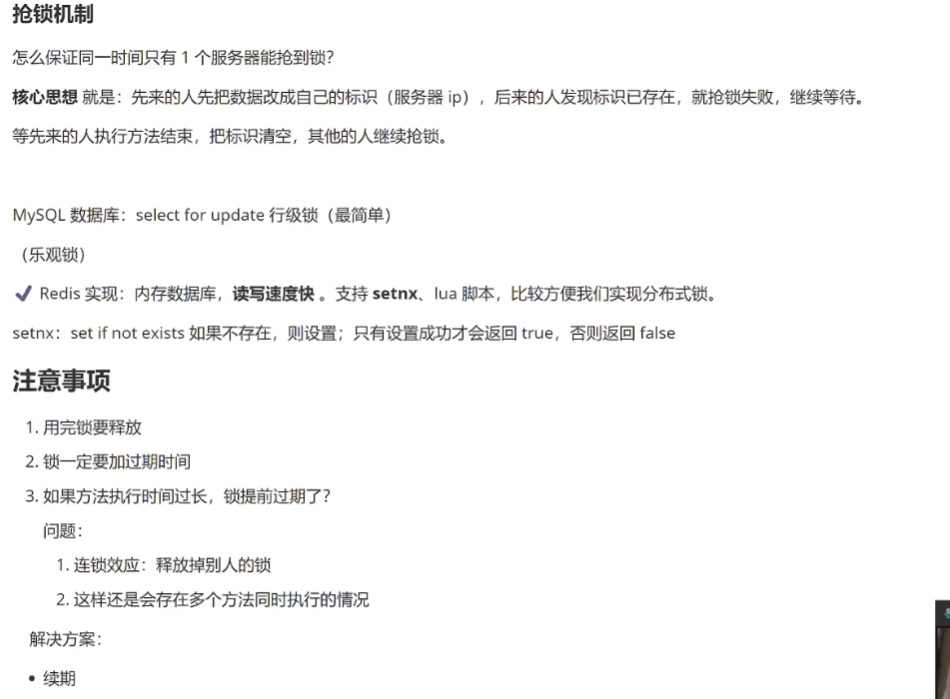
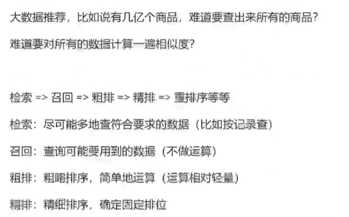

## 前端

1. 在界面中的 script标签中加上 `setup`，则script标签中所写的东西都会暴露给 `template`标签，就不用写return了。

2. vue路由的使用，可以先查看官方入门文档 https://router.vuejs.org/zh/guide/，进行简单配置，注意`routes`要单独配置在一个ts文件中，这样便于后期拓展。随后可以查看vant tabbar的路由模式进行进一步使用。

   

3. 在使用ts 中的map时 当数组为基础类型时原数组不变，当数组为引用类型时原数组发生改变。避免原数组发生改变：**（重要）**

```typescript
let array = [{ name: 'Anna', age: 16 }, { name: 'James', age: 18 }]
let newArray=array.map((item) => {
    const obj = { ...item, like:'eat'};
    return obj;
})
console.log(array); // [{ name: 'Anna', age: 16},{ name: 'James', age: 18}]
console.log(newArray);//[{ name: 'Anna', age: 16,like: "eat"},{ name: 'James', age: 18,like: "eat"}]
```

4. **router传参**

​	在一个界面跳转的另一个界面时需要带过去一些参数，可以通过query 或者 params 进行传参。



上图使用query进行传参，会以地址栏问号的形式进行显示，如下图所示。



而使用params进行传参使用 `/` 加参数的形式进行传参，需要在 route.ts 界面进行 : 设置对应参数。地址栏如下图所示。



一般使用query传参比较方便但是影响SEO。https://blog.csdn.net/Lyy_ID/article/details/141058857#:~:text=###%20%E5%9B%9E%E7%AD%94

5. 

6. 默认情况下 在同一个域名下 就算端口不一样  jessionid  也会根据请求进行变换。种session的时候要注意范围，可以在配置文件中进行配置，  cookie.domain。如果想要共享cookie，可以种一个更高层的公共域名。

### **如何实现共享存储（让两个服务端都去一个地方取session）？**

1. redis（基于内存的 k/v 数据库）此处此处选择Redis，因为用户信息读取 / 是否登录的判断及其频繁。   Redis基于内存，读写性能很高
2.  MySQL
3. 文件服务器ceph

### **整合使用Redis**

1. 引入Redis ，可以使用Redis

```xml
<!-- https://mvnrepository.com/artifact/org.springframework.boot/spring-boot-starter-data-redis -->
<dependency>
    <groupId>org.springframework.boot</groupId>
    <artifactId>spring-boot-starter-data-redis</artifactId>
    <version>2.6.13</version>
</dependency>
```

2. 引入spring-session和redis的整合，使得自动将session存储到redis中

```xml
<!-- https://mvnrepository.com/artifact/org.springframework.session/spring-session-data-redis -->
<dependency>
    <groupId>org.springframework.session</groupId>
    <artifactId>spring-session-data-redis</artifactId>
    <version>2.6.4</version>
</dependency>
```

3. 修改sesion的存储位置 `sessoin.store-type:redis`,默认是none，表示存储在单台服务器。


### **创建公共组件**

1. 将公共部分单独抽象为一个vue文件，然后在使用到的地方引用这个组件
2. 在创建公共组件时需要定义 传入的值，如下图

​	

3. 使用如下图

​	


### vue路由的两种模式：hash与history的区别

1.hash模式带#号比较丑，history模式比较优雅；

2.pushState设置的新的URL可以是与当前URL同源的任意URL；而hash只可修改#后面的部分，故只可设置与当前同文档的URL；

3.pushState设置的新URL可以与当前URL一模一样，这样也会把记录添加到栈中；而hash设置的新值必须与原来不一样才会触发记录添加到栈中；

4.pushState通过stateObject可以添加任意类型的数据到记录中；而hash只可添加短字符串；

5.pushState可额外设置title属性供后续使用；

6.hash兼容IE8以上，history兼容IE10以上；

7.history模式需要后端配合将所有访问都指向index.html，否则用户刷新页面，会导致404错误。

来源：https://blog.csdn.net/qq_26780317/article/details/117790679


## 后端

搜索标签的两种方式

1. SQL查询（实现简单，可以通过拆分查询进一步优化）
2. 内存查询（灵活，可以通过并发进一步优化）


**优化方向**

* 如果参数可以分析，根据用户的参数去选择查询方式，比如标签数。
* 如果参数不可分析，并且数据库连接足够、内存空间足够，可以并发同时查询，谁先返回用谁。
* 还可以SQL查询与内存计算相结合，比如先用SQL过滤掉部分tag


**Java 8**

1. stream/parallelStream 流式处理
2. Optional可选类


### **后端整合Swagger**

1. SpringBoot2.6.x之后的版本的默认匹配策略为path-pattern-matcher，需要手动修改path-pattern-matcher规则，否则会报错。

```yml
# 修改swagger的路径匹配配置，使其兼容新版的SpringBoot
spring:
  mvc:
    pathmatch:
      matching-strategy: ant_path_matcher
```

2. Swagger版本2.9.2 需要访问网址 http://localhost:8080/api/swagger-ui.html，

   整合knife4j时可以直接引入依赖

   ```pom
   <!--        整合Swagger和knife4j-->
           <dependency>
               <groupId>com.github.xiaoymin</groupId>
               <artifactId>knife4j-spring-boot-starter</artifactId>
               <version>2.0.7</version>
           </dependency>
   ```

   访问网址为http://localhost:8080/api/doc.html

3. 跨域携带cookie设置

   1. 首先需要在创建axios实例的时候，设置携带cookie。

      ```typescript
      myAxios.defaults.withCredentials = true; //发送请求的时候携带 cookies
      ```

   2. 然后需要设置后端返回数据的请求头，在方法或类上加上如下：

       ```java
       @CrossOrigin(origins = {"http://localhost:5173"},allowCredentials = "true")
       ```


## **缓存的实现**

* Redis（分布式）
* memcached（分布式）
* Etcd（云原生架构的一个分布式存储，**存储布置**，扩容能力强，同步能力强）

****

* ehcahe（单机）
* 本地缓存（java内存Map）
* Caffeine（java内存缓存，高性能）
* Google Guava


### Redis

> NoSQL 数据库

key-value存储系统（区别于MySQL,存储的是键值对）

**Java里的实现方式**

Spring Data Redis(推荐)

Spring Data:通用的数据访问框架，定义了一组**增删改查**的接口。

可以操作 mysql，redis，jpa

Jedis：独立于Spring 操作Redis 的java客户端，要配合jedis pool 使用

Lettuce:高阶的操作redis的java客户端

Redisson：分布式操作redis的java客户端，让你像在使用本地集合一样（分布式redis 数据网格）


**对比：**

1. 如果使用的是spring，并且没有过多的定制化要求，可以用spring data redis，最方便
2. 如果使用的不是spring，并且追求简单，并且没有过高的性能要求，可以使用jedis+jedis pool
3. 如果使用的不是spring，并且追求高性能，高定制化，可以用Lettuce，支持异步，连接池

-----

+ 如果你的项目是分布式的，需要用的一些分布式的特性（比如分布式的锁，分布式集合），推荐使用redisson


### Redis 数据结构

String 字符串类型 ：name: ”yupi“

List列表：names:["yupi","dogyupi"]

Set 集合：names:["yupi"] {值不能重复}

Hash哈希：nameAge:{"yupi": 1,"dogyupi": 2}

Zset 集合: names:{yupi - 9,dogyupi - 12}  可以多插一个分数

*****

以下偶尔使用

bloomfilter(布隆过滤器，主要从大量的数据中快速过滤值，比如邮件黑名单拦截)

geo(计算地理位置)

hyperloglog（pv/uv）

pub / sub (发布订阅，类似消息队列)

BitMap（存储     010101010110101010110100）


### Redis序列化

Redis中key，value 默认使用的是 java 自带的序列化器。

序列化之后 会在存入redis中加入一些其他的东西，我们可以自定义redis的序列化器（上网搜）。


### 设计缓存key

不同用户看到的数据不同。

systemId:moduleId:func(可选) （不要和别人冲突）

yupao:user:recomend:userId

**redis 内存不能无限增加，一定要设置过期时间！！！！**


### 缓存预热

问题：第一个用户访问还是很慢（假如第一个是；老板访问怎么办），也能一定程度上保护数据库。

缓存预热的优点：

1. 解决上面的问题：可以让用户始终访问的很快

缺点：

1. 增加开发成本（更加麻烦，需要额外设计）
2. 预热的时机和时间如果错了，有可能缓存的数据不对或者太老
3. 需要占用额外的空间


> 进行设计时一定要根据具体业务场景进行。
>
> 分析优缺点时要打开思路，从整个项目从 0 到 1 的链路上去分析。包括用户和开发人员可能遇到的问题


## 定时任务实现

1. Spring Scheduler (spring boot 默认整合)
2. quarts（独立于Spring存在的定时任务框架）
3. xxl-job ，powerjob，SnailJob等分布式任务调度平台（界面+sdk）


#### 控制定时任务的执行

1. 浪费资源，10000台服务器同时 增 或 查
2. 脏数据，比如重复插入


**要控制定时任务同一时间只有一台服务器运行**

1. 分离定时任务和主程序，只在1个服务器运行定时任务，成本太大

2. 写死配置，每个服务器都执行定时任务，只有ip符合配置的机器才执行真实的业务逻辑，其他直接返回。成本最低，但是 IP可能是不固定的，把IP写的太死，不好修改

3. 动态配置，配置是可以轻松的，很方便地更新（**代码无需重启**），但是只有ip符合配置的机器才执行真实的业务逻辑。

   * 数据库
   * Redis
   * 配置中心（Nacos,Apollo,Spring Cloud Config）

   问题：服务器多了，IP不可控还是很麻烦的，还是要人工修改

4. 分布式锁，只有抢到锁的服务器才能执行业务逻辑。坏处：增加成本；好处：不用手动配置，多少个服务器都一样。


## 分布式锁实现关键




4. 线程A判断出是自己的锁后，在准备删锁时，A的锁刚好过期了，这时B线程进来将锁改为自己的。然后A线程删除了B线程刚设置的锁。这时C线程发现没锁了就也进来了。会导致B,C同时执行。

```java
//原子操作
if(get lock == A){
    //set lock B
    del lock;
}
```

Redis + lua脚本 可以实现原子操作

5. Redis如果是集群（不是只有一个Redis），如果分布式锁的数据不同步怎么办？ **（红锁，自己了解，加分项）**


## Redisson 实现分布式锁

java 客户端，数据网格

实现了很多java里支持的接口和数据结构

Redisson是一个java操作Redis的客户端，**提供了大量的分布式数据集来简化对 Redis的操作和使用，可以让开发者使用本地集合一样使用Redis，完全感知不到Redis的存在。**

  

#### **分布式锁的三种实现机制**

1. 基于数据库实现分布式锁；
2. 基于缓存（Redis等）实现分布式锁；
3. 基于Zookeeper实现分布式锁；

网址：https://www.cnblogs.com/liuqingzheng/p/11080501.html


**2种引入reidsson的方式**

1. spring boot starter （不推荐，版本迭代快，容易冲突）
2. 直接引入

#### 定时任务 + 锁

1. waitTime 设置为 0，只抢一次，抢不到就放弃
2. 注意释放锁要写在finally

#### 看门狗机制

>redisson 中提供的续期机制

开一个监听线程，如果方法还没有执行完，就会帮你重置 reis 锁的过期时间。

原理：

1. 监听当前线程，默认每10秒续期一次，每次只续 30秒。
2. 如果线程挂掉（注意debug模式也会被当成服务器宕机），则不会续期


## 标签匹配实现

### 1.怎么匹配

1. 找到共同标签多的用户（TopN）
2. 共同标签越多，分数越高，就越排在前面
3. 如果没有匹配的用户就随机推荐几个（降级方案）


**标签推荐算法**

本文主要使用余弦相似度算法

原理：https://blog.csdn.net/qq_36488175/article/details/109787805

一些计算两个字符串相似度的算法：https://blog.csdn.net/qq_58202163/article/details/132109983


### 2.怎么对所有用户匹配，取Top

直接取出所有用户一次计算分数，然后排序。

优化方法：

1. 不要在数据量大的时候循环输出日志

2. Map存了所有用户信息占用内存。

   解决：维护一个固定长度的有序集合（sortedSet），只保留分数最高的几个用户

3. 细节：剔除自己

4. 尽量只查需要的用户：
   1.  过滤掉标签为空的数据
   2. 根据部分标签取用户(前提是能区分出哪个标签更重要)
   3. 只查需要的数据（比如id 和 tags）
5. 提前查？
   1. 提前所有的用户给缓存（不适用于经常更新的数据）
   2. 提前运算出来结果缓存（针对一些重点用户缓存）




### 分表学习建议

mycat、sharding sphere框架，一致性hash


## 优化，上线，部署

### 如何改造

**将网页改为app可以用 cordova，跨端开发框架taro，uniapp**

**上线**

1. 区分多环境：前端区分开发和线上的接口，后端prod改为用线上公网可访问的数据库

​	2. vercel 


## 一些面试可能会问到的问题解答

**为什么需要请求参数包装类？**

1. 请求参数名称/类型和实体类不一样
2. 有一些参数用不到，如果要自动生成接口文档，更加清晰明了
3. 多个实体类映射到同一个对象

**为什么需要包装类**

1. 可能有一些字段需要隐藏，不能返回给前端
2. 或者有些字段某些是不关心的
