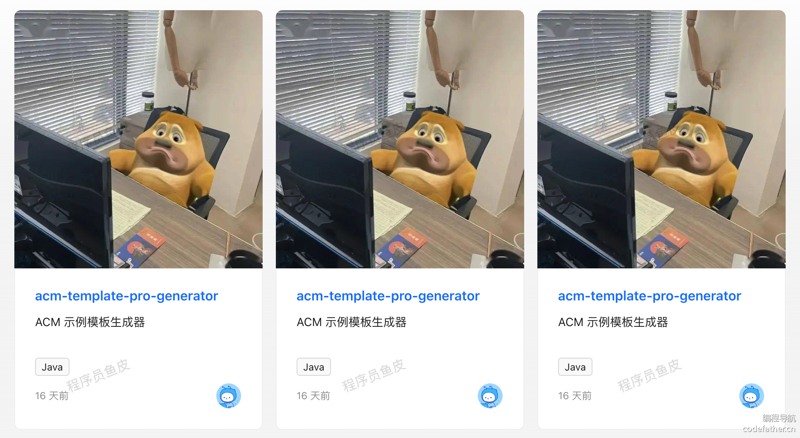
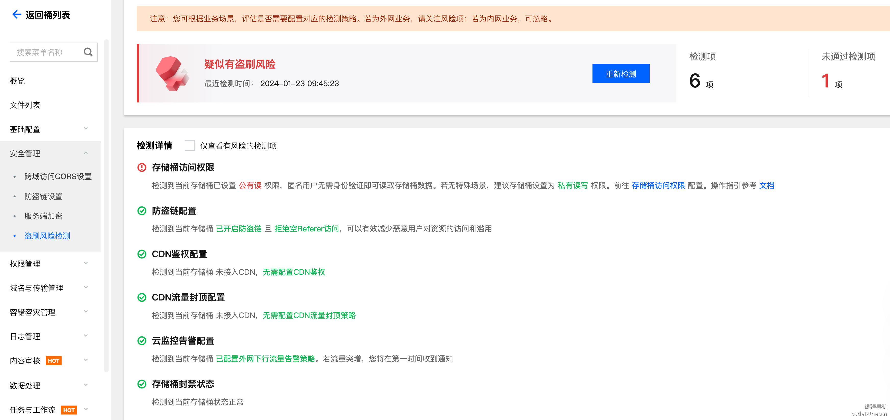
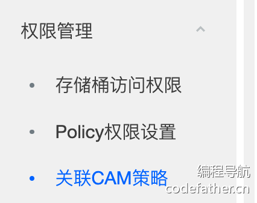

# 鱼籽代码生成器


## 有用的小技巧

1. 使用idea中的 .ignore插件 可以快速生成 各类的ignore文件，比如 .dockerignore，.gitignore等。

2. ```
   String projectPath = System.getProperty("user.dir");
   ```

以上命令获取的项目根路径，和idea中打开的项目有关如果打开的是


yuzi-generator 则根目录是yuzi-generator,如果直接打开yuzi-generator-basic则运行的是yuzi-generator-basic。

3. 简化代码的圈复杂度

   + 封装函数

   + 卫语句，尽早返回，减少嵌套。

   + 运用一些灵活的方法，函数等。如下函数所示

   + ```java
     private static void validAndFillMetaRoot(Meta meta) {
             // 校验并填充默认值
             String name = StrUtil.blankToDefault(meta.getName(), "my-generator");
             String description = StrUtil.emptyToDefault(meta.getDescription(), "我的模板代码生成器");
             String author = StrUtil.emptyToDefault(meta.getAuthor(), "yupi");
             String basePackage = StrUtil.blankToDefault(meta.getBasePackage(), "com.yupi");
             String version = StrUtil.emptyToDefault(meta.getVersion(), "1.0");
             String createTime = StrUtil.emptyToDefault(meta.getCreateTime(), DateUtil.now());
             meta.setName(name);
             meta.setDescription(description);
             meta.setAuthor(author);
             meta.setBasePackage(basePackage);
             meta.setVersion(version);
             meta.setCreateTime(createTime);
             
             // 基础信息校验
             String name = meta.getName();
             if(StrUtil.isBlank(name)){
                 meta.setName("my-generator");
             }
             String description = meta.getDescription();
             if(StrUtil.isEmpty(description)){
                 meta.setDescription("我的模板代码生成器");
             }
             String basePackage = meta.getBasePackage();
             if(StrUtil.isBlank(basePackage)){
                 meta.setBasePackage("com.learn");
             }
             String version = meta.getVersion();
             if(StrUtil.isEmpty(version)){
                 meta.setVersion("1.0");
             }
             String author = meta.getAuthor();
             if(StrUtil.isBlank(author)){
                 meta.setAuthor("dt");
             }
             String createTime = meta.getCreateTime();
             if(StrUtil.isEmpty(createTime)){
                 meta.setCreateTime(DateUtil.now());
             }
         }
     ```

4. 增加可拓展性

   + 避免 魔法值 ，可以用枚举类。

   + 魔板方法模式

   + 什么是模板方法模式？

     模板方法模式通过**父类定义了一套算法的标准执行流程**，然后**由子类具体实现每个流程的操作**。使得子类在不改变执行流程结构的情况下，可以自主定义某些步骤的实现。

     举个例子，老师让所有的学生每天必须按顺序做 3 件事：

     1. 吃饭
     2. 睡觉
     3. 支持鱼皮

     这相当于定义了一套标准的执行流程，每位学生都必须遵循这个流程去行动，但是可以有不同的做法。

     比如小王：

     1. 吃拉面
     2. 站着睡觉
     3. 给鱼皮三连

     而小李可以：

     1. 吃米饭
     2. 躺着睡觉
     3. 给鱼皮点赞

     这样，不仅可以让子类的行为更加规范、复用父类现成的执行流程，也可以通过创建新的子类来自定义每一步的具体操作，提高了程序的可扩展性。
   
5. 实体类(entity,VO,DTO)

   + entity:此对象与数据库表结构对应，通过 DAO层向上传输数据源对象。
   + VO：显示层对象，主要是传给前端的，要脱敏。
   + DTO：数据传输对象，根据具体业务设置的。前端传到后端的数据，需要用DTO去承接。

6. 文件过滤机制设计

   文件过滤可以有很多种不同的配置方式，鱼皮梳理归纳了 2 类配置：

   - 过滤范围：根据文件名称、或者文件内容过滤。
   - 过滤规则：包含 contains、前缀匹配 startsWith、后缀匹配 endsWith、正则 regex、相等 equals。

   由于制作工具已经支持输入多个文件 / 目录，所以其实每个文件 / 目录都可以指定自己的过滤规则，而且能同时指定多条过滤规则（必须同时满足才保留），进一步提高灵活性。

   参考文件过滤机制的 JSON 结构如下：

   ```json
   ▼json复制代码{
     "files": [
       {
         "path": "文件（目录）路径",
         "filters": [
           {
             "range": "fileName",
             "rule": "regex",
             "value": ".*lala.*"
           },
           {
             "range": "fileContent",
             "rule": "contains",
             "value": "haha"
           }
         ]
       }
     ],
   }
   ```

   上面的 JSON 表示：该文件的名称必须符合正则并且内容必须包含 `haha`。

   通过这种设计，可以非常灵活地筛选文件。如果想使用 or 逻辑（有一个过滤条件符合要求就保留），可以定义多个重复的 file，并且每个 file 指定一个过滤条件来实现。哪怕同时满足了多个过滤器，我们的去重逻辑也能搞定。
   
7. json 中赋值要用双引号包围，不能用单引号。下式中blob就不能用单引号，吃了大亏。

   ```tsx
   <Button onClick={async () => {
           const blob = await testDownloadFileUsingGet({
               filePath: value 
           }, {
               responseType: "blob",
           });
           // 使用 file-saver 下载文件
           const fullPath = COS_HOST + value;
           saveAs(blob, fullPath.substring(fullPath.lastIndexOf('/') + 1));
       }}>
       点击下载文件
   </Button>
   ```

8. Maven 的 `install` 命令是 Maven 构建生命周期中的一个重要阶段，用于将项目构建的产物（如 JAR、WAR 等）**安装到本地仓库**，使得其他 Maven 项目可以通过坐标（GroupId、ArtifactId、Version）引用该依赖。


## 通用文件上传下载能力

首先我们要思考：将文件上传到哪里？从哪里下载？

最简单的方式就是上传到后端项目所在的服务器，直接使用 Java 自带的文件读写 API 就能实现。但是，这种方式存在不少缺点，比如：

1. 不利于扩展：单个服务器的存储是有限的，如果存满了，只能再新增存储空间或者清理文件。
2. 不利于迁移：如果后端项目要更换服务器部署，之前所有的文件都要迁移到新服务器，非常麻烦。
3. 不够安全：如果忘记控制权限，用户很有可能通过恶意代码访问服务器上的文件，而且想控制权限也比较麻烦，需要自己实现。
4. 不利于管理：只能通过一些文件管理器进行简单的管理操作，但是缺乏数据处理、流量控制等多种高级能力。

因此，除了存储一些需要清理的临时文件之外，我们通常不会将用户上传并保存的文件（比如用户头像）直接上传到服务器，而是更推荐大家使用专业的第三方存储服务，专业的工具做专业的事。其中，最常用的便是 **对象存储** 。

临时文件可以存储在服务器上，最好及时删除。需要持久化的文件用对象存储。

具体操作看这次项目的文件上传和下载

 


## 性能优化

## 一、性能优化思路

在正式对生成器平台项目进行优化前，先给大家分享一些经典的性能优化思路。

首先明确性能优化的定义和目标。性能优化是指通过 **持续的** 分析、实践和测试，确保系统稳定高效运行，从而满足用户的诉求。

性能优化闭环：


### 性能优化分类

一般情况下，我们把性能优化分为 2 大类：

1）通用优化

是指一些经典的、对于绝大多数情况都适用的优化策略。比如增大服务器的并发请求处理数、使用缓存减少数据库查询、通过负载均衡分摊请求、同步转异步等。

2）对症下药

是指结合具体的业务特性和系统现状，先通过性能监控工具、压力测试等方式，分析出系统的性能瓶颈，再针对性地选取策略进行优化。

比如数据库单次查询超过 1 秒，属于慢查询，根据实际的查询条件给对应的字段增加索引，一般就能提高查询性能。

实际开发中，这两类性能优化策略通常都要使用。在系统设计和开发阶段，我们要根据自己的经验，本能地引入一些性能优化的手段，降低后续系统出现问题、需要迭代优化的概率。此外，性能优化一定是持续的，随着需求、用户、系统用量的增多，原本性能符合要求的系统也可能会出现各种新的问题，很难面面俱到、一步到位。

但是，对于复杂的、对可用性和稳定性要求极高的项目，我们可以提前通过压力测试来模拟用户量极大的情况，并提前做好性能优化和应对措施。

### 通用性能优化手段

有哪些通用的性能优化手段呢？

我们以一个请求的完整生命周期为例，依次去介绍。

通常，用户从发送请求，到最终得到数据，要分别经过以下节点：


每个节点，我们都有对应的优化方法：

1）前端：

- 离线缓存：利用浏览器的缓存机制，请求过一次的资源就不用重复请求，提高页面加载速度。
- 请求合并：页面请求过多时，将多个小请求合并成一个大请求，减少网络开销。
- 懒加载：延迟加载页面的图片等元素，提高首屏加载速度。

2）网关：

- 负载均衡：负责接受请求，根据一定的路由算法转发到对应的后端系统，实现多个后端服务器分摊请求，增大并发量。
- 缓存：将后端返回的数据进行缓存，下次前端请求时，直接从网关获取数据，减少后端调用、提高数据获取速度。

3）后端请求层：

- 服务器优化：根据业务特性，选择性能更高的服务器并调整参数，比如 Nginx、Undertow 等。
- 微服务：将大型服务拆分为小型服务，并通过微服务网关进行转发，增大各服务的并发处理能力。

4）业务逻辑层：

- 异步化：将同步的业务逻辑改为异步，尽早响应，提高并发处理能力。
- 多线程：将复杂的操作拆分成多个任务，通过多线程并发执行，提高任务处理效率。

5）中间件（第三方依赖）：

- 缓存：将数据库查询出的结果数据缓存到性能更高的服务（比如基于内存的 Redis 或本地），减少数据库的压力、并提高数据查询性能。
- 队列：使用消息队列，对系统进行解耦、或者将操作异步化，实现流量的削峰填谷。

6）存储层：

- 分库分表：数据量极大时，对数据库进行垂直或水平切分，提高数据库并发处理能力。
- 数据清理：定期清理无用或过期的数据，减少存储压力，必要时可以对数据进行备份转储。

虽然有那么多性能优化方法，但并不是每一种都要用、每一种都有用。在做性能优化时，一定要根据实际情况，权衡性价比和系统改动风险，并且做好充分的测试，不要好心优化、结果给系统导入了新的 Bug。而且一般情况下，不建议大家为了优化盲目引入新技术，先从成本最低的优化方法开始。

举个例子，**你在本地使用 Elasticsearch 优化了查询性能，但是公司根本没有成本采购 Elasticsearch**，这就脱离了实际情况。

大家先了解这些方法，日后做性能优化时能够想起来就足够了。

### 下载生成器接口

接口名称：downloadGeneratorById

#### 1、整体测试分析

性能优化时，首先需要测试分析。先不关注接口的细节，直接调用并查看接口的整体耗时，分析是否需要优化。

进入到下载页面，按 F12 打开网络请求控制台，点击 “下载生成器” 测试。

最好多测试几次观察平均时间，如下图：


注意，不同配置的电脑 / 服务器测试结果肯定不同，性能测试要以自己的实际测试情况为主。

我们平台上的代码生成器，一般属于小文件，而视频文件一般属于大文件。对于下载小文件来说，这个时间其实是可以接受的，用户无需等待很久。

但万一用户上传的生成器是大文件呢？

其实比较好的方法是限制用户上传的文件体积。但如果用户的生成器文件就是很大，怎么办？

这里我们就提前测试一下，应对系统可能出现的问题。

修改 web 项目的 application.yml 配置文件，解除文件上传大小限制：

```yaml
▼yaml复制代码# 文件上传
servlet:
  multipart:
    # 大小限制
    max-request-size: 100MB
    max-file-size: 100MB
```

测试上传并下载一个 30 多 MB 的文件，发现性能急剧下降，需要等待近 20 秒才会提示用户下载：


系统用户量不多的情况下，问题倒也不大，但是如果有多个用户同时下载、或者大量用户频繁下载这个文件，服务器的带宽可能会有压力，而且每次下载都会消耗对象存储的流量，都是成本啊！

所以我们必须解决这个问题。

#### 2、分析代码耗时

接下来，我们需要通过分析核心代码，统计关键代码的操作耗时，来定位接口的性能瓶颈 —— 即哪一步操作耗时最多。

可以使用 Spring 提供的 `StopWatch` 计时器工具类，给下载接口添加统计耗时代码：

```java
▼java复制代码StopWatch stopWatch = new StopWatch();
stopWatch.start();

COSObject cosObject = cosManager.getObject(filepath);
cosObjectInput = cosObject.getObjectContent();
// 处理下载到的流
byte[] bytes = IOUtils.toByteArray(cosObjectInput);

stopWatch.stop();
System.out.println(stopWatch.getTotalTimeMillis());
```

通过统计耗时发现，最核心的耗时因素在于 **从第三方对象存储服务下载文件** （这也是我们预料之中的），流程是先下载完整文件到服务器后，再整体写入到响应输出流。

```java
▼java复制代码// 处理下载到的流，本质上是下载完整文件到服务器
byte[] bytes = IOUtils.toByteArray(cosObjectInput);
// 写入响应输出流
response.getOutputStream().write(bytes);
response.getOutputStream().flush();
```

定位到了核心性能瓶颈，接下来如何优化呢？

#### 3、下载优化 - 遵循最佳实践

由于是从第三方对象存储服务下载，所以如果需要优化，首先的出发点就是充分了解第三方服务。

对于大厂的服务，一般都有官方文档的最佳实践，建议阅读，而不要自己凭直觉瞎猜。

比如 COS 对象存储的官方文档：https://cloud.tencent.com/document/product/436/13653

在文档中介绍了几种方法，比如使用 CDN 就近下载、调试下载操作相关对象的参数等。


由于使用 CDN 会引入额外的开销，此处不采用。这种优化方式更适用于有实际收入的项目。

#### 4、下载优化 - 流式处理

下载大文件时，除了下载慢之外，还可能会占用服务器的内存、硬盘空间，导致资源紧张。

所以，如果文件较大、并且服务端不用处理文件，可以选用流式处理，通过循环的方式，持续从 `COSObjectInputStream` 读取数据并写进响应输出流，防止过大的文件占满内存。

示例代码如下：

```java
▼java复制代码// 设置响应头
response.setHeader(HttpHeaders.CONTENT_DISPOSITION, "attachment; filename=" + fileName);
response.setContentType(MediaType.APPLICATION_OCTET_STREAM_VALUE);

// 将 InputStream 写入到 HttpServletResponse 的 OutputStream
try (OutputStream out = response.getOutputStream()) {
    byte[] buffer = new byte[4096];
    int bytesRead;

    while ((bytesRead = cosObjectInput.read(buffer)) != -1) {
        out.write(buffer, 0, bytesRead);
    }
} catch (IOException e) {
    // 处理异常
    e.printStackTrace();
}
```

在前端进行测试，发现采用这种方式后，下载文件时响应内容的大小会逐渐递增，而不是阻塞半天后一次性得到完整的响应结果。

**但是经过测试发现，大文件整体的下载时间并没有得到明显的减少。因为无论是否流失处理，服务器都要先从 COS 对象存储下载文件，再返回给前端。**

如果后端内存太小而下载的文件又太大，后端放不下就可以用这种方法，分批下载。

那么如果要优化，是否可以不从对象存储下载文件呢？

#### 5、下载优化 - 本地缓存

答案是肯定的。代码生成器文件的业务特点是 **读多写少** ，是一个典型的缓存适用场景。

其实 CDN 本质上就是一种缓存，如果不想使用 CDN 增加开销的话，可以选用本地缓存。不需要引入额外的存储技术，只需要将下载过一次的代码生成器保存在服务器上，之后要下载时，如果服务器已经有下载好的文件，就不用从对象存储获取，直接读取并返回给前端即可。

缓存的 4 个核心要素：

1. 缓存哪些内容？
2. 缓存如何淘汰？
3. 缓存 key 如何设计？
4. 如何保证缓存一致性？

首先是缓存哪些内容，个人不建议每个文件都缓存，原因是难以控制占用的空间、并且还要考虑每个文件的缓存一致性，会增大开发成本。

而且，如果每个文件都缓存，还需要对象存储么？不就有点像自己实现了一个简单的 CDN 么？

所以此处我们选择一种相对简单的实现方式：手动设置哪些文件需要缓存，并且可以通过接口提前缓存指定文件。

1）在 GeneratorController 中编写一个缓存生成器的接口 `cacheGenerator`。

代码如下：

```java
▼java复制代码/**
 * 缓存代码生成器
 *
 * @param generatorCacheRequest
 * @param request
 * @param response
 */
@PostMapping("/cache")
@AuthCheck(mustRole = UserConstant.ADMIN_ROLE)
public void cacheGenerator(@RequestBody GeneratorCacheRequest generatorCacheRequest, HttpServletRequest request, HttpServletResponse response) {
    if (generatorCacheRequest == null || generatorCacheRequest.getId() <= 0) {
        throw new BusinessException(ErrorCode.PARAMS_ERROR);
    }

    // 获取生成器
    long id = generatorCacheRequest.getId();
    Generator generator = generatorService.getById(id);
    if (generator == null) {
        throw new BusinessException(ErrorCode.NOT_FOUND_ERROR);
    }

    String distPath = generator.getDistPath();
    if (StrUtil.isBlank(distPath)) {
        throw new BusinessException(ErrorCode.NOT_FOUND_ERROR, "产物包不存在");
    }

    // 缓存空间
    String zipFilePath = getCacheFilePath(id, distPath);

    // 新建文件
    if (!FileUtil.exist(zipFilePath)) {
        FileUtil.touch(zipFilePath);
    }

    // 下载生成器
    try {
        cosManager.download(distPath, zipFilePath);
    } catch (InterruptedException e) {
        throw new BusinessException(ErrorCode.SYSTEM_ERROR, "压缩包下载失败");
    }
}
```

2）设计缓存 key

缓存 key 相当于数据的 id，用来唯一标识和查找某个缓存内容。

一般情况下，写入缓存的 key 和读取的 key 是一致的，所以编写一个公共方法来获取缓存 key。

由于没有引入额外的缓存技术，这里的缓存 key 就是文件在服务器上的路径。

代码如下：

```java
▼java复制代码/**
 * 获取缓存文件路径
 *
 * @param id
 * @param distPath
 * @return
 */
public String getCacheFilePath(long id, String distPath) {
    String projectPath = System.getProperty("user.dir");
    String tempDirPath = String.format("%s/.temp/cache/%s", projectPath, id);
    String zipFilePath = String.format("%s/%s", tempDirPath, distPath);
    return zipFilePath;
}
```

3）修改生成器下载接口，优先从缓存获取。

修改后的代码如下：

```java
▼java复制代码// 追踪事件
log.info("用户 {} 下载了 {}", loginUser, distPath);

// 设置响应头
response.setContentType("application/octet-stream;charset=UTF-8");
response.setHeader("Content-Disposition", "attachment; filename=" + distPath);

// 优先从缓存读取
String zipFilePath = getCacheFilePath(id, distPath);
if (FileUtil.exist(zipFilePath)) {
    // 写入响应
    Files.copy(Paths.get(zipFilePath), response.getOutputStream());
    return;
}

COSObjectInputStream cosObjectInput = null;
try {
    StopWatch stopWatch = new StopWatch();
    stopWatch.start();
    COSObject cosObject = cosManager.getObject(distPath);
    cosObjectInput = cosObject.getObjectContent();
    // 处理下载到的流
    byte[] bytes = IOUtils.toByteArray(cosObjectInput);
    stopWatch.stop();
    System.out.println(stopWatch.getTotalTimeMillis());
    // 写入响应
    response.getOutputStream().write(bytes);
    response.getOutputStream().flush();
} catch (Exception e) {
    log.error("file download error, filepath = " + distPath, e);
    throw new BusinessException(ErrorCode.SYSTEM_ERROR, "下载失败");
} finally {
    if (cosObjectInput != null) {
        cosObjectInput.close();
    }
}
```

4）测试调用

首先执行缓存接口，提前下载一个大文件。然后调用接口下载该文件，使用 F12 网页控制台查看下载接口耗时。

测试发现，使用文件缓存后，接口响应时长大幅缩短！只需 100 多毫秒就能完成下载，快了 100 多倍！


对于热门的代码生成器，**采用本地缓存的方式不仅能大大减少下载时长，还能节约对象存储的流量开销**，两全其美。

不过，以上只是跑通了流程，演示了缓存的效果。实际项目开发中，还应该做以下几点：

1）除了调用接口缓存外，还可以通过一些方法自动识别出热点生成器并缓存。比如增加使用次数字段统计使用情况，然后通过定时任务（或者每次下载后）检测使用情况是否超过热点阈值，超过的话表示是热点数据，设置缓存。

> 推荐了解开源的热 key 发现系统，京东 HotKey：https://gitee.com/jd-platform-opensource/hotkey

2）设置合适的缓存淘汰机制。比如编写一个清理缓存的接口，人工定期清理；或者给缓存设置一个过期时间，通过定时任务定期清理。

3）保证缓存一致性。如果用户重新上传了代码生成器文件，应该保证用户下载到的不是缓存而是最新的文件。最简单的实现方式就是更新时删除缓存，还可以使用延迟双删等策略。对于我们的系统来说，缓存一致性要求并不高，感兴趣的同学可以自行了解实现。

### 制作生成器接口

#### 1、整体测试

跟之前一样，先测试接口的整体耗时。以制作一个 ACM 模板项目生成器为例，测试结果如下：


平均每次制作要花费 3 秒左右，应该是有一定优化空间的。

测试结果如下图（单位为毫秒）：


#### 3、优化策略

分析上图，发现主要的耗时操作是下载和制作。

先优化下载耗时。分析下载流程，**先让用户将模板文件上传到对象存储、再从对象存储下载的过程其实是没必要的**。因为平台现在仅支持单次制作，制作完成后，用户上传的模板文件就没用了。所以不如**直接通过请求参数传递原始文件给后端，既节约了对象存储资源、又提升了性能。**

这里作为一个扩展点，感兴趣的同学可以自主实现。

虽然制作操作耗时比下载耗时更多，但其实 2 - 3 秒是可以接受的范围，而且由于调用了 maker 项目、使用 Maven 进行打包，优化的成本较大，此处暂不考虑。（应该也是需要多线程并发）

如果制作耗时超过 20 秒，可以考虑使用 **异步化** ，**将生成器制作封装为一个任务，用户可以通过前端页面自主查询任务的执行状态并下载制作结果。**

## 查询性能优化

什么情况下需要对数据查询进行性能优化呢？

一般有以下几个场景：

1. 数据需要高频访问
2. 数据量较大，查询缓慢
3. 数据查询实时性要求高，追求用户体验

对于我们的代码生成项目，主页代码生成器列表的访问频率应该是最高的，而且主页一般也需要有较快的加载速度，所以本小节我们就来优化主页调用的 **分页查询生成器接口** 。

通过这个例子，给大家分享常用的数据查询接口优化方法。

### 方法一、精简数据

目前，整个系统的数据量不大，我们先不考虑高并发，从最简单的优化开始做起，目标是减少接口的响应时长，从而提高页面的加载速度。

### 方法二、SQL 优化

最常见的几种方案：

1. 减少查询次数，能不查数据库就不查数据库，比如使用缓存。
2. 优化 SQL 语句
3. 添加合适的索引

进行优化时，我们优先选择成本最低的方案。

第 1 种方案通常需要引入额外的技术（缓存），所以等下我们再考虑。

第 3 种方案虽然改动成本不高，但是对于我们的主页查询，默认并没有任何的查询条件（除了 isDelete = 0），所以也不适用于添加索引来优化。

所以我们目前最应该做的，就是优化 SQL 语句。既然有些字段不需要在主页展示，那我们是不是都不用从数据库中查出这些字段了呢？

在 SQL 控制台测试一下，如果不查询 fileConfig 和 modelConfig 字段，执行 10 次的总耗时 1020 毫秒，减少 10% 左右。

有时候，就是这么简单的优化，只要你能想到，就能大幅提升性能。

> 扩展：分页查询接口中，还有一个耗时的操作 —— 使用 count 语句统计总数，是否可以优化呢？

一般来说，单次查询时间超过 100ms、500ms 或者 1s 算是慢查询。目前接口的性能还可以，能够应对用户量不大的场景。但如果同时使用系统的用户增多、并发量增大呢？我们又该如何优化系统？

### 方法三、压力测试

在进行优化前，首先我们要掌握一个重要的性能测试方法 —— 压力测试。

由于我们的系统并没有那么多的并发请求，所以必须通过压力测试工具，通过造线程模拟真实用户请求的方式，来实现高并发测试。

下面我们就用主流的压力测试工具 Apache JMeter，给大家演示如何模拟高并发场景来测试接口。

#### 0、明确测试情况

首先，一定要明确测试的环境、条件和基准。

举个例子，鱼皮本次的测试情况：

- 环境：使用 16 G 内存、10 核 CPU、百兆带宽的网速
- 条件：每次请求相同的接口、传递相同的参数
- 基准：始终保证接口异常率 0%，出现异常则需要重新测试

**注意，压测前保证不会影响系统的正常运行，千万不要在线上压测！**

> 线上压测 ≈ 造事故 ≈ 攻击


### 方法四、分布式缓存

想要提升数据的查询性能，最有效的办法之一就是 **缓存** 。把数据放到一个读取更快的存储，而不用每次都从数据库查询。

缓存尤其适用于 **读多写少** 的数据，可以最大程度利用缓存、并且减少数据不一致的风险。

对于我们的项目，生成器的修改频率一般是很低的，而且实际运营时，生成器应该是需要人工审核才能展示到主页，所以对数据更新实时性的要求并不高，使用缓存非常合适。而像实时电商数据大屏这种需要持续展示最新数据的场景，用缓存的成本就比较大了。

此处，我们使用主流的、基于内存的分布式缓存 Redis，来存储生成器分页数据，它的读写性能远超 MySQL。

2）缓存 key 设计。

先设计缓存的 key，规则为：`业务前缀:数据分类:请求参数`。

业务前缀和数据分类的作用是为了区分不同业务和接口的缓存，防止冲突。

将请求参数作为 key，就能实现不同的分页查询不同的缓存。需要注意的是，请求参数字符串可能很长，所以我们选用 base64 进行编码。

### 方法五、多级缓存

如果 Redis 缓存还不够快，我们还可以使用本地缓存，直接从内存中读取缓存、不需要任何网络请求，一般能得到进一步的性能提升。

#### 1、Caffeine 本地缓存

要想在 Java 中使用本地缓存，推荐使用 Caffeine 库，这是一个主流的、高性能的本地缓存库。相比于自己构造 HashMap，Caffeine 还支持多种数据淘汰、数据通知、异步刷新等能力，更易用。

想入门 Caffeine 这种类库，最好的方式还是阅读官方文档。

Caffeine 官网：https://github.com/ben-manes/caffeine

中文教程：https://github.com/ben-manes/caffeine/wiki/Home-zh-CN

从这里开始：https://github.com/ben-manes/caffeine/wiki/Population-zh-CN

> 注意，根据官方文档，Caffeine 3 版本需要 Java 11 或以上，Java 8 请用 Caffeine 2 版本！

其实非常简单，几行代码就能实现缓存的增删改查：

```java
▼java复制代码Cache<Key, Graph> cache = Caffeine.newBuilder()
    .expireAfterWrite(10, TimeUnit.MINUTES)
    .maximumSize(10_000)
    .build();

// 查找一个缓存元素， 没有查找到的时候返回null
Graph graph = cache.getIfPresent(key);
// 查找缓存，如果缓存不存在则生成缓存元素,  如果无法生成则返回null
graph = cache.get(key, k -> createExpensiveGraph(key));
// 添加或者更新一个缓存元素
cache.put(key, graph);
// 移除一个缓存元素
cache.invalidate(key);
```

#### 2、多级缓存设计

对于分布式系统，我们一般不会单独使用本地缓存，而是将本地缓存和分布式缓存进行组合，形成多级缓存。

就以 Caffeine 和 Redis 为例，通常用 Caffeine 作为一级缓存，Redis 作为二级缓存。

1）Caffeine 一级缓存：将数据存储在应用程序的内存中，性能更高。但是仅在本地生效，而且应用程序关闭后，数据会丢失。

2）Redis 二级缓存：将数据存储在 Redis 中，所有的程序都从 Redis 内读取数据，可以实现数据的持久化和缓存的共享。

二者结合，请求数据时，首先查找本地一级缓存；如果在本地缓存中没有查询到数据，再查找远程二级缓存，并且写入到本地缓存；如果还没有数据，才从数据库中读取，并且写入到所有缓存。

使用多级缓存，可以充分利用本地缓存的快速读取特性，以及远程缓存的共享和持久化特性。

#### 3、多级缓存开发

首先在 `manager` 包下新建一个通用的多级缓存类 `CacheManager`，并分别编写读取缓存、写入缓存、清理缓存的方法。

完整代码如下：

```java
▼java复制代码package com.yupi.web.manager;

import com.github.benmanes.caffeine.cache.Cache;
import com.github.benmanes.caffeine.cache.Caffeine;
import org.springframework.data.redis.core.StringRedisTemplate;
import org.springframework.stereotype.Component;

import javax.annotation.Resource;
import java.util.concurrent.TimeUnit;

/**
 * 多级缓存
 */
@Component
public class CacheManager {

    @Resource
    private StringRedisTemplate stringRedisTemplate;

    // 本地缓存
    Cache<String, String> localCache = Caffeine.newBuilder()
            .expireAfterWrite(100, TimeUnit.MINUTES)
            .maximumSize(10_000)
            .build();

    /**
     * 写缓存
     *
     * @param key
     * @param value
     */
    public void put(String key, String value) {
        localCache.put(key, value);
        stringRedisTemplate.opsForValue().set(key, value, 100, TimeUnit.MINUTES);
    }

    /**
     * 读缓存
     *
     * @param key
     * @return
     */
    public String get(String key) {
        // 先从本地缓存中尝试获取
        String value = localCache.getIfPresent(key);
        if (value != null) {
            return value;
        }

        // 本地缓存未命中，尝试从 Redis 中获取
        value = stringRedisTemplate.opsForValue().get(key);
        if (value != null) {
            // 将从 Redis 获取的值放入本地缓存
            localCache.put(key, value);
        }

        return value;
    }

    /**
     * 移除缓存
     *
     * @param key
     */
    public void delete(String key) {
        localCache.invalidate(key);
        stringRedisTemplate.delete(key);
    }
}
```

### 方法六、计算优化

#### 1、分析

任何计算都会消耗系统的 CPU 资源，在 CPU 资源有限的情况下，我们能做的就是 **减少不必要的计算** 。

分析我们的代码，基本上没有循环计算逻辑，可能消耗计算资源的操作应该就是 JSON 序列化（反序列化）。

> 在 JSON 序列化中，需要遍历数据结构并将其转换为 JSON 格式的字符串。这个过程中可能涉及到字符串拼接、字符编码转换等计算密集型操作。

之前是为了更直观地查看缓存数据，才将对象序列化为 JSON 后写入缓存，现在为了提高性能，我们可以直接用 JDK 默认的序列化工具读写缓存。

### 方法七、请求层性能优化

#### 1、参数优化

分析上述测试结果，当并发请求数量超出系统处理能力时，会出现请求排队，而且请求排队最大时间长达 8 秒。

怎么能解决这个问题呢？

用生活场景来类比。就跟去快餐店一样，如果服务员不够了，只要增加工作人员的数量，就能同时服务更多顾客。

而如果餐厅备菜的速度足够快，可以增加排队的最大容量，起码业务繁忙时不用把顾客赶出去。

回到我们的后端系统，如果业务逻辑层很难进一步优化，可以尝试优化请求层。

比如 Spring Boot 项目默认使用嵌入式的 Tomcat 服务器接受处理请求，可以调整 tomcat 的参数，比如最大线程数 maxThreads、最大连接数 maxConnections、请求队列长度 accept-count 等，来增加同时接受处理请求的能力。

比如：

```yaml
▼yaml复制代码server:
  tomcat:
    threads:
      max: 1024
```

> 推荐文章：https://www.cnblogs.com/javastack/p/17756325.html

需要注意，更高的最大线程数设置未必能提升 qps。因为在 CPU 资源有限的情况下，线程数过多可能导致资源的竞争和上下文的频繁切换。所以最大线程数设置为多少，取决于实际的性能测试。

思考：qps 还能进一步优化么？或者说，我们优化的极限到底在哪里？如何得到这个极限呢？

#### 2、测试空接口性能

可以编写一个干净的、没有任何业务逻辑的接口，然后测试 Tomcat 服务器处理请求的最大性能。

1）编写一个干净的接口

```java
▼java复制代码/**
 * 健康检查
 */
@RestController
@RequestMapping("/health")
@Slf4j
public class HealthController {

    @GetMapping
    public String healthCheck() {
        return "ok";
    }
}
```

2）注释掉请求拦截器，防止额外的处理逻辑干扰测试结果：


3）测试

新增一个线程组来压力测试，修改测试接口地址为 `/health`，使用之前的线程组配置（1000 个线程、100 组、10 秒启动）。

测试发现，空接口的 qps 最高能到 6500 左右。


在我的电脑环境下，这可能就是一个接近极限的数字，说明无论我们再怎么优化业务逻辑，qps 也不会超过这个值。

#### 3、Vert.x 反应式编程

如果接受请求的服务器性能有限，那我们就尝试更换一个性能更高的服务器（或者请求处理框架），比如基于反应式编程的 Vert.x。

为什么选择它呢？首先它是基于 Java 的。另外，在 techempower 最新的压力测试排行榜上，我们发现 Vert.x 这个框架的排名高达第 7 名！


而 Spring 排名是第 88 名，Vert.x 甩了 Spring 几条街。

不过，这只是别人的测试结果，使用 Vert.x 真的能够提高我们接口的性能么？还是要以实际测试为准。

##### Vert.x 入门

首先通过 [官方文档](https://vertx.io/) 了解 Vert.x，据官方介绍，Vert.x 的优点在于：

1. 充分利用资源节约成本
2. 更方便的并发和异步编程
3. 使用更灵活，易于整合、启动和部署

想入门 Vert.x，首先阅读官方的入门教程：https://vertx.io/get-started/，提供了示例 Demo。

不过 Vert.x 的学习成本是比较高的，官方文档写的一般，而且入门教程页面都存在问题，所以建议还是以鱼皮的教程为主。

1）先引入依赖：

```xml
▼xml复制代码<!-- https://mvnrepository.com/artifact/io.vertx/vertx-core -->
<dependency>
    <groupId>io.vertx</groupId>
    <artifactId>vertx-core</artifactId>
    <version>4.5.1</version>
</dependency>
```

2）写一个 Web 服务器，提供 Http 接口。

在 Vert.x 中，可以通过定义 Verticle 来实现 Web 服务。Verticle 是 Vert.x 中的一个组件，用于处理事件、执行业务逻辑，并能够在 Vert.x 实例中进行水平扩展，Verticle 之间可以相互通讯。

> 为了便于理解，你可以把它当成一个嵌入式的 Tomcat。

参考官方的 Demo，写一个简单的 Verticle，提供无业务逻辑的接口并响应 “ok”。

代码如下：

```java
▼java复制代码package com.yupi.web;

import io.vertx.core.AbstractVerticle;
import io.vertx.core.Verticle;
import io.vertx.core.Vertx;

public class MainVerticle extends AbstractVerticle {

    @Override
    public void start() throws Exception {
        // Create the HTTP server
        vertx.createHttpServer()
                // Handle every request using the router
                .requestHandler(req -> {
                    req.response()
                            .putHeader("content-type", "text/plain")
                            .end("ok");
                })
                // Start listening
                .listen(8888)
                // Print the port
                .onSuccess(server ->
                        System.out.println(
                                "HTTP server started on port " + server.actualPort()
                        )
                );
    }

    public static void main(String[] args) throws Exception {
        Vertx vertx = Vertx.vertx();
        Verticle myVerticle = new MainVerticle();
        vertx.deployVerticle(myVerticle);
    }
}
```

当然，如果感兴趣的话，也可以尝试使用 Vert.x web 组件开发接口，有点类似 Node.js 后端框架的语法。

参考代码如下：

```java
import io.vertx.core.AbstractVerticle;
import io.vertx.core.Future;
import io.vertx.core.http.HttpServer;
import io.vertx.core.http.HttpServerRequest;
import io.vertx.ext.web.Router;

public class MyVerticle extends AbstractVerticle {

    @Override
    public void start(Future<Void> startFuture) {
        // Create an HTTP server
        HttpServer server = vertx.createHttpServer();

        // Create a router to handle requests
        Router router = Router.router(vertx);

        // Define a route that handles GET requests to "/hello"
        router.get("/hello").handler(this::handleHello);

        // Set the router as the request handler for the server
        server.requestHandler(router);

        // Listen on port 8080
        server.listen(8080, ar -> {
            if (ar.succeeded()) {
                System.out.println("Server started on port 8080");
                startFuture.complete();
            } else {
                System.out.println("Failed to start server");
                startFuture.fail(ar.cause());
            }
        });
    }

    // Handler method for the "/hello" route
    private void handleHello(HttpServerRequest request) {
        // Respond with a "Hello, Vert.x!" message
        request.response()
            .putHeader("content-type", "text/plain")
            .end("Hello, Vert.x!");
    }
}
```

##### Vert.x 为什么快？

官方文档中，有很多关于 Vert.x 特性和原理的讲解，比如：

- 链式调用：https://vertx.io/docs/vertx-core/java/#_are_you_fluent
- 异步非阻塞：https://vertx.io/docs/vertx-core/java/#_dont_block_me
- 反应式编程：https://vertx.io/docs/vertx-core/java/#_reactor_and_multi_reactor
- 事件总线：https://vertx.io/docs/vertx-core/java/#event_bus

那 Vert.x 到底为什么快呢？这里讲几个重点概念，讲完大家就清楚了。

###### 1）异步非阻塞

很多经典面试题都是围绕这个概念展开的，比如：

- 什么是同步和异步？
- 什么是阻塞和非阻塞？
- 什么是异步非阻塞？

下面依次回答。

同步：一个任务的完成需要等待另一个任务的结果。必须按照顺序，先完成上一个任务，才能执行下一个任务。

比如下面的代码：

```java
▼java复制代码Result result = httpClient.get();
System.out.println(result);
```

在通过 http 请求获取到结果后，才会输出，这就是同步执行。

异步：一个任务的完成不需要等待另一个任务的结果。比如我要先烧一壶水、再去学编程，按下烧水按钮后，不需要干瞪眼等水烧好，可以直接去学编程了。异步通常会涉及回调、事件通知机制，比如水烧好后会有响声，提醒我们水已经烧好，我们就可以取水了。

比如下面的代码：

```java
▼java复制代码CompletableFuture<Result> future = CompletableFuture.supplyAsync(() -> {
    // 异步操作，例如发起 HTTP 请求
    return httpClient.get();
});

System.out.println("请求没完成，我也能执行");

// 等请求完成，自动输出
resultFuture.thenAccept(result -> {
    System.out.println(result);
});
```

即使 HTTP 请求每完成，也会先输出 "请求没完成，我也能执行"；而当请求完成后，会自动输出结果。

------

阻塞：执行一个任务时，需要一直等待，期间无法执行其他任务，直到执行完成。

比如下面的代码：

```java
▼java复制代码request() {
    Result result = db.query();
}
```

直到数据库返回结果前，当前线程会一直卡在 request 方法，不能处理其他任务。

非阻塞：执行一个任务时，不需要等待，可以继续执行其他任务。然后通过定时的检查来确认任务是否完成，也就是所谓的轮询。

用一个例子来区分阻塞和非阻塞。比如我要通过电话联系某人。如果是阻塞方式，只要对方不接电话，我就一直拿电话等着，不能再给其他人打电话。如果是非阻塞方式，我可以每隔 10 分钟打一次电话，这期间即使对方不在，我也能继续给别人打电话，直到最后打通。

------

同步 / 异步、阻塞 / 非阻塞之间有什么区别呢？

网上众说纷纭，这里分享我个人比较喜欢的一种解释：

- 同步 / 异步更关注 **消息通信机制** ，即调用方以什么方式获取到结果，是直接返回、还是通过回调通知。
- 阻塞 / 非阻塞更关注线程在等待调用结果时的状态。如果是阻塞，会一直占用线程资源；而如果是非阻塞，发起调用后可以立即返回，线程可以被解放出来做其他的工作。

------

异步非阻塞就是结合了异步和非阻塞的优点，在执行操作时即使没有得到结果，也不会阻塞当前线程、可以继续执行下一个操作；并且得到结果后会通过回调等方式通知程序处理结果。

还有一个常用概念是 NIO（非阻塞 I/O），是 Java 提供的一组支持非阻塞 I/O 操作的 API，通过通道、缓冲区、选择器等组件，实现了一个线程同时处理多个通道请求的能力；并且实现了事件驱动机制，当通道有事件发生时，通过选择器响应，而不是轮询所有的通道。

如下图：通过 Selector，可以复用一个线程处理多个 Channel（客户端连接）。


举个生活中的例子，要收整个班级的作业，不用让老师一个一个学生收、也不用每个学生分配一个老师一直等着，直接让做完作业的学生通知老师即可，这期间老师可以做其他事情。

###### 2）事件驱动

事件驱动是一种编程范式，指整个系统间的各个组件通过发送和接收事件进行通信和协作，从而实现异步非阻塞 IO。

举个例子，前端和后端协作开发，可以先分别开发、各干各的，不用等待对方开发完成再开发。等后端写完了接口，告诉前端 “我写好了”（相当于发送了一个事件），前端接收到这个信息后，就可以对接后端了。

不过以上只是一个便于大家理解的例子，实际的事件驱动实现中，一般会有事件总线（Event Bus）的概念，相当于一个中间人，负责接受所有的事件，并分发给不同的事件处理者。


> 学过消息队列的同学，应该会更好理解事件驱动，两者都能实现异步通信和应用解耦。

###### 3）事件循环

事件循环是实现事件驱动的核心操作，也是实现异步、非阻塞编程的方法。

在一个事件循环中，程序会不断地检查事件队列，如果有新事件到达，就会触发相应处理程序的回调函数来执行。允许程序在等待 I/O 操作完成的同时继续执行其他任务，而不会阻塞整个进程。

举个生活中的例子，老师要收整个班级的作业，可以找一位课代表，课代表 **每小时** 循环检查所有同学交的作业情况，如果发现有新的提交，就通知老师批改。这样老师就不用一直等着学生完成作业（I / O 操作），不去做其他的事情。

> Node.js 就使用了事件循环机制，实现了非阻塞 IO 和事件驱动。

###### 4）反应式编程

反应式编程是一种编程范式，常用于异步的数据流和事件处理，通过声明的方式来定义处理规则。

它最核心的作用还是实现了异步处理（类似 CompletableFuture），只不过通过一系列 API 的支持，便于我们更轻松地处理异步数据。

举个例子，传统的同步编程方式：

```java
public class UserService {
    public User getUserById(long userId) {
        // 同步查询数据库
        return userRepository.findById(userId);
    }
}
```

上述代码中，`getUserById` 方法是同步的，当执行数据库查询时，线程会被阻塞，等待查询结果返回。如果系统中有大量的并发请求，这种同步阻塞的方式可能会导致性能瓶颈，因为每个请求都需要等待数据库查询完成。

如果使用反应式编程，示例代码如下：

```java
import reactor.core.publisher.Mono;

public class UserService {
    public Mono<User> getUserById(long userId) {
        // 使用反应式编程的 Mono 封装异步查询
        return userRepository.findById(userId);
    }
}
```

上述代码中，`getUserById` 方法返回的是 Reactor 的 Mono 类型，表示异步计算的结果，我们可以再对这个 Mono 类型定义各种复杂的处理操作。其中调用的 `userRepository.findById` 是一个异步的数据库查询操作，不会阻塞当前线程。

------

Vert.x 正是使用了以上几个概念，才能够同时处理更多的并发请求。

但如果将我们的接口使用 Vert.x 重构，真的会更快么？

**所有的性能优化都要以实际测试为准！**


## 存储优化

## 一、存储优化思路

存储是一个很广泛的概念，有很多种存储技术，比如数据库存储、内存存储、对象存储、块存储、文件存储等。

可以从多个不同的角度进行存储优化，比如

- 存储空间优化
- 存储成本优化
- 存储安全性优化
- 存储可用性优化
- 存储可靠性优化
- 存储性能优化

下面分别介绍每一点，分享一些通用的存储优化手段（不仅仅局限于对象存储这一种存储技术）。

### 通用存储优化手段

#### 存储空间优化

主要的目标是减少存储空间的占用，常用的方法有：

1. 压缩：使用压缩算法对数据进行压缩，减小存储空间的占用。常见的压缩算法有 gzip、zstd 等。
2. 分区分表：常用于数据库和大数据存储，将大量数据分别存放于不同的分区和表中，从而提高单表查询性能，并减小单表数据量。
3. 数据清理（归档）：定期清理过期或不再需要的数据。或者将不常用的数据归档到其他存储中。就像我们管理自己的电脑一样，多余的文件可以拷贝到单独的硬盘里。
4. 数据去重：去除重复的数据或者复用数据，常用于网盘系统的实现（比如秒传功能）。

#### 存储成本优化

顾名思义，减少存储消耗的成本。

存储空间优化一般情况下也会带来存储成本的优化，但是二者的概念不完全相同。

存储成本优化除了空间方面的考虑外，还要考虑存储管理和维护成本、设备成本、使用成本等，目标是在提供足够性能和可用性的前提下，降低整个存储系统的总体成本。

常用的优化方法有：

1. 选择合适的存储技术：专业的存储服务特定的业务，比如用图数据库存储关联数据、向量数据库存储向量数据，往往“事半功倍”。
2. 合理采购存储资源： 从需求和业务出发，评估存储用量，避免过度购买存储资源。

此外，不同存储的成本优化方式不尽相同，比如本节要讲到的 COS 对象存储，官方提供了一些成本优化的建议。

#### 存储安全性优化

存储安全性优化的目标是保护存储数据的完整、安全，防止数据泄露等。

常用方法有：

1. 数据加密：使用合适的加密算法确保数据在存储过程、存储对象上的安全性。
2. 备份恢复：定期备份数据，以便在数据丢失或损坏时能够迅速恢复。
3. 访问控制：设置合适的权限和访问控制策略，确保只有授权用户能够访问存储的数据。
4. 日志审计：记录关键操作的日志，便于出现问题后的故障定位。还可以通过定期查阅日志，提前发现一些潜在的问题。

此外，不同存储的安全性优化方式不尽相同。比如本节要讲到的 COS 对象存储，官方提供了很多安全优化的建议，后文会带大家实践。

#### 其他优化

前文提到的几种优化方式是对于开发者来说相对可干预的，此外，还有一些其他的存储优化角度，比如：

1. 存储可用性优化：保证存储系统在任何时候都能正常提供服务，常用方法有容错、冗余备份、故障转移、快速故障检测恢复等。
2. 存储可靠性优化：保证数据的完整性和系统地稳定性。可以通过在底层选用高可靠的硬件设备来实现。
3. 存储性能优化：提高存储系统的读写速度、降低响应延迟等。
4. 存储管理优化：提高操作存储、配置和监控存储资源的有效性，可以通过自动化管理工具实现。
5. 存储可观测性优化：更好地检测存储系统的运行状态、资源占用和行为。可以通过可视化监控看板、完备的日志和告警系统实现。

对于开发方向的同学，其他优化角度仅做了解即可。实际开发中，我们一般会选用第三方云服务提供的存储，比如腾讯云的 COS 对象存储，已经为我们提供了可用性、可靠性、性能、存储管理、可观测性的支持保障。

------

所以接下来，以使用 COS 对象存储为前提，主要从以下几个角度对我们的代码生成项目进行存储优化。

- 存储空间优化
- 存储成本优化
- 存储安全性优化

## 三、存储成本优化

前文已经分享了几个成本优化的方法，比如合适的技术选型、按量购买、节约空间等。

如果使用的是第三方云服务，最好参考官方的成本优化方案，比如 COS 对象存储的成本优化解决方案文档：https://cloud.tencent.com/document/product/436/50201，写得非常详细，阅读一遍能收获很多思路。RtkVN3dhIPExx9F0k+suUHyrF2bfOUeqN9ihUmgNcpk=

鱼皮帮大家总结几个重点。

对于大部分企业来说， **存储容量费用** 和 **流量费用** 是其云存储成本的主要组成部分。成本优化也可以从这些角度进行。

### 选择合适的存储

要根据实际的需求和业务选择对象存储的类型和业务地域。

腾讯云 COS 提供了标准存储、低频存储、归档存储、深度归档存储，后三种存储类型的存储容量费用较低。

官方提供的费用参考表：I8CexaJsjeqL/Gux7c0sL7ZhO61pp97z28+t4OYx0qE=


我们会发现， **存储总费用最低的存储类型未必最合适** 。如果业务数据下载量较低，则选择归档存储甚至深度归档存储能有效降低存储成本，最冷的深度归档存储相较标准存储可节省 90% 存储费用；但如果业务数据需要频繁下载，则低频存储、归档存储、深度归档存储的取回费用会带来额外的成本开销，导致整体费用反而更高。

具体到业务场景中，官方推荐：RtkVN3dhIPExx9F0k+suUHyrF2bfOUeqN9ihUmgNcpk=

1. 频繁读写场景：例如 UGC 场景、电商图片等读多写少的业务，可使用标准存储类型。如果业务对可用性和数据持久性有高要求，则可以考虑使用标准存储（多 AZ）。
2. 少量读场景（一个月读一次）：例如日志数据分析、网盘数据等业务，读取频率较低，但读取时对性能要求高，可使用低频存储类型。对可用性和数据持久性有高要求的业务可以使用低频存储（多 AZ）。
3. 极少量读场景（三个月读一次）：例如视频监控、日志数据归档等业务，读取频率极低，对读取性能要求较低，可使用归档存储类型。
4. 基本不读取场景（半年读一次）：例如医疗影像、档案资料等业务，日常仅做长期备份用途，对读取性能几乎无要求，可使用深度归档存储类型。

### 数据沉降

对于大部分数据而言，其访问热度一般随着存储时间延长而降低。因此，如果想严格控制成本，需要根据业务数据访问情况的变化，分析调整数据存储类型

一般情况下，数据沉降分为 2 个阶段：先分析再沉降。

1）先分析：通过对象存储提供的清单 / 访问日志分析，或者业务代码中自行统计分析。

2）再沉降：可以直接通过对象存储提供的 **生命周期** 功能自动沉降数据，如下图：


对于我们的项目，可以将很久不访问的代码生成器沉降到存储成本更低的低频存储中。除了利用生命周期功能外，**也可以通过数据库记录代码生成器的使用和下载时间，自行调用 API 批量沉降数据或者转储到其他服务。**

### 减少访问

减少访问的目的是降低流量费，比如使用本地文件缓存，减少访问对象存储的文件。

CDN 本质上也是一种缓存，虽然能减少对象存储的访问（回源），但是会有额外的 CDN 流量费用。


## 四、存储安全性优化

存储安全是至关重要的，目前我们的对象存储访问权限为“公有读”，处于“半裸奔状态”。下面我们通过多种方式优化。

### 官方建议

首先阅读官方文档：https://cloud.tencent.com/document/product/436/50200FzExKY2x+B3Oxyl7pmwibovDxAZlANLJHGG0P3NIEcU=

官方提供了很多种安全方案：

1）KMS 白盒密钥：和设备绑定，安全性极高；但是成本较高。

2）权限隔离：授权 CAM 用户 **可以在哪种条件下，通过哪种方式对哪些资源进行哪种操作** 。Byua4im2vA3aEVogaeLjX6hI1L0lovTk6UTHY05ATNg=

如下图：


3）对象锁定：对于一些核心敏感数据，如金融交易数据、医疗影像数据等，可通过对象锁定功能来防止文件在上传之后被删除或者篡改。配置对象锁定功能后，在配置的有效期内，存储桶内的所有数据将处于只读状态，不可覆盖写或者删除。sM4A+3xdwBSFwvpMpB9cOEbFO5AcjmIxZeRVIk+Lxo4=


4）数据灾备：通过版本控制和存储桶复制实现异地容灾，进一步保证数据持久性，确保数据误删或者被恶意删除时可从备份站点恢复数据。

版本控制：每次操作都会创建一个新版本的文件，通过“删除标记”来区分文件是否被删除（逻辑删除）。可通过指定版本号访问过去任意版本的数据，还可以进行数据回滚，解决数据误删和覆盖的风险。wX/L440VwCUsvFmLAKq50Dhlz9fQrPjP9OfNSvvaIfU=


存储桶复制：当主存储桶中的数据被删除时，可从备份存储桶中通过批量拷贝的方式恢复数据。


冷备份：考虑到版本控制和存储桶复制功能都可能造成文件数增加，用户也可以通过生命周期功能将一些备份数据沉降至低频或者归档存储等更便宜的存储类型，从而实现低成本冷备。

完整的冷备方案如下图：


此外，还可以通过事中监控（操作对象存储时触发事件通知）、事后追溯（查看日志）等手段，帮助我们分析排查安全性问题。

### 安全管理

COS 对象存储的控制台中提供了几个安全管理功能，如图：XV+0xcLku2rZ6S4YjPoN42Sg+/1NGWR4caY/icBxBgo=


包括跨域设置、防盗链配置、服务端加密、安全风险检测等。

#### 1、跨域访问设置

跨域访问即通过 HTTP 请求，从一个域去请求另一个域的资源。只要协议、域名、端口有任何一个不相同，都会被当作是不同的域。

注意，跨域是浏览器的限制，一般用于前端直传对象存储的场景。

> 设置跨域访问的官方文档：https://cloud.tencent.com/document/product/436/13318

进入跨域访问设置控制台：


可以自由添加规则，根据自己的域名、请求方法、需要的请求头信息配置即可：XV+0xcLku2rZ6S4YjPoN42Sg+/1NGWR4caY/icBxBgo=


配置完成后，对象存储（服务端）就会允许该域名的跨域请求，可以灵活添加多条规则：


#### 2、防盗链设置

> 官方文档：https://cloud.tencent.com/document/product/436/13319

盗链是指在网站或应用程序中，直接引用并展示其他网站上的资源（如图片、音频、视频等），而未经该资源拥有者的许可。比如 A 用户有一个壁纸网站，B 用户直接把 A 用户网站的所有图片爬取到自己网站中，并且用 A 网站的图片地址展示，实际消耗的还是 A 网站的流量！这是一种成本极低、危害极大的攻击方式。FzExKY2x+B3Oxyl7pmwibovDxAZlANLJHGG0P3NIEcU=

如何防盗链呢？

可以通过请求头中的 referer（网站请求来源）来进行校验，如果请求头中没有该字段，或者不是预期的来源，就禁止请求。

可以在控制台中进行防盗链配置。QPJZeYFaUqR36x4kwqYY/HDgbmmyWDYclj2BSOSB8ko=

假设项目上线的前端域名是 `yupi.com`，建议配置白名单，仅允许特定范围的域名访问，并且拒绝空 referer。如图：


保存防盗链设置后，再打开本地域名为 `localhost` 的前端网站，发现图片无法加载：Byua4im2vA3aEVogaeLjX6hI1L0lovTk6UTHY05ATNg=


打开控制台，发现图片加载请求报错 403，访问被禁止，说明防盗链生效：


再次修改防盗链允许的 Referer，增加 `localhost` 域名：


再次保存，这次图片正常加载：XV+0xcLku2rZ6S4YjPoN42Sg+/1NGWR4caY/icBxBgo=



#### 3、服务端加密

> 官方文档：https://cloud.tencent.com/document/product/436/40117

服务端加密又分为：加密存储和加密传输，适用于安全性较高的使用场景。

加密存储：数据写入磁盘之前，对数据进行加密，并在访问数据时自动解密。加密和解密这一操作过程都是在服务端完成，有效保护数据。

加密传输：COS 提供用 HTTPS 部署 SSL 证书实现加密的功能，在传输链路层上建立加密层，确保数据在传输过程中不会被窃取及篡改。Ngn04MbHiFYJ3dYOysCNZbqvGBx4DwUt1T+Hq5oEBT0=

需要注意的是，文件加密会有一定的性能影响，所以要慎重开启。以下是官方原文：

> 文件加密需要用客户侧密钥，或者 COS 托管密钥，或者 KMS 密钥将文件内容加密成密文，因此会有一定的性能损耗，主要体现在访问延迟增加。这一延迟增加对大文件读写影响不明显，但在小文件读写中会有一定影响。

可以在服务器加密控制台开启：sM4A+3xdwBSFwvpMpB9cOEbFO5AcjmIxZeRVIk+Lxo4=


#### 4、盗刷风险检测

COS 提供了盗刷风险检测功能，非常实用，可以轻松发现潜在的安全风险。I8CexaJsjeqL/Gux7c0sL7ZhO61pp97z28+t4OYx0qE=

如下图，我们的存储访问权限存在风险：



### 权限管理实践

首先明确我们的需求：对于图片资源，允许所有用户读；对于其他文件（比如代码生成器产物包），禁止匿名用户访问。

COS 对象存储提供了几种权限管理方法，用户的总权限为这三种管理方法的组合。k8/IOcxCB7n3JEylQZLahWqkNO1rF46Vq6FFcc8uq9I=

如下图：



1）存储桶访问权限：可以控制已有账号、子账号操作存储桶的权限。粒度较粗。XV+0xcLku2rZ6S4YjPoN42Sg+/1NGWR4caY/icBxBgo=

2）自定义 policy 权限：可以更灵活地控制某个用户、在某个条件下、对某个资源的、某种操作权限。粒度更细。


**实际使用时，建议两者结合。**wX/L440VwCUsvFmLAKq50Dhlz9fQrPjP9OfNSvvaIfU=

COS 对象存储权限校验的流程图如下：

> 参考访问策略评估流程文档：https://cloud.tencent.com/document/product/436/41516


下面我们来实践一下。
